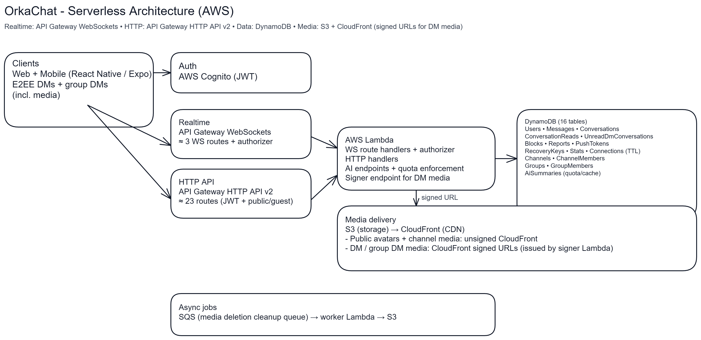

# OrkaChat

Open‑source (**MIT‑licensed**) cross‑platform chat app (iOS / Android / Web) with **end‑to‑end encrypted (E2EE)** messaging, channels, media attachments, and AI tooling. Built with **React Native + Expo (RN Web)** on the frontend and **AWS (Amplify Gen 2 + API Gateway + Lambda)** on the backend.

Primary web app: **`https://chat.orkaos.com/`**

Legacy redirects:
- `https://app.orkaos.com/` → `https://chat.orkaos.com/`
- `https://orkaos.com/chat` → `https://chat.orkaos.com/`

## Legal & support

- Legal index: `https://projxon.github.io/OrkaChat/index.html`
- Privacy policy: `https://projxon.github.io/OrkaChat/privacy.html`
- Delete account: `https://projxon.github.io/OrkaChat/delete-account.html`

## SEO / indexing (Google)

For Google to crawl the web app and rank the brand query (“OrkaChat”), we publish:

- `frontend/public/robots.txt` → `https://chat.orkaos.com/robots.txt`
- `frontend/public/sitemap.xml` → `https://chat.orkaos.com/sitemap.xml`

After deploying those files, set up **Google Search Console**:

- Add a **Domain property** for `orkaos.com` (recommended; covers `chat.orkaos.com`)
- Verify via **DNS TXT record**
- Submit the sitemap (`https://chat.orkaos.com/sitemap.xml`)
- Use **URL inspection** to request indexing for `https://chat.orkaos.com/`

## Features

### Messaging
- **Encrypted DMs + group DMs (E2EE)**
- **Channels**
- **Persistent chat** (history kept) + **“Last active” sorting** in chats
- **Typing indicator**
- **Sent / delivered confirmation**
- **Read receipts** (optional / where supported)
- **Edit messages**
- **Delete messages**
- **Reactions**

### Media
- **Multi‑media messages** (images / video) with **previews**
- **In‑app camera capture** for attaching media
- **Encrypted media in DMs / group DMs (E2EE media)**
- **File attachments + native file viewer** (PDF, Office docs, archives, audio, etc.)
- **Voice clips** + **inline audio player**

### Safety & Moderation
- **Block users**
- **Report messages and users** (UGC compliance friendly)

### UX / Personalization
- **User profile settings**: avatar colors + optional image (crop + zoom)
- **Chat background settings**: color or image
- **Splash screens** (light/dark)

### Web portal
- **Open Graph (OG) previews** for sharing
- **Mobile‑like rotated device layouts** supported on web

### AI
- **AI summarization**
- **AI reply / response suggestions** using chat context
- **Streaming AI responses (SSE)** when the backend is wired behind a streaming-capable endpoint (the app can target a dedicated base URL via `AI_API_URL`)

### Platform
- **Guest mode** (read‑only/public endpoints)
- **Mobile push notifications**
- **Local UI caches (AsyncStorage)** for faster cold-start hydration (e.g. display name, avatar settings, channel/DM labels)

## Security (high level)

- **Transport security**: Client ↔ backend traffic uses **HTTPS/WSS (TLS)**.
- **E2EE (DMs + group DMs)**:
  - Clients generate a **secp256k1** keypair.
  - DMs use **secp256k1 ECDH** to derive a shared secret, then derive a 32‑byte key (SHA‑256) and encrypt message payloads with **AES‑256‑GCM**.
  - Group DMs encrypt the message payload with a per‑message random key (**AES‑256‑GCM**) and **wrap** that key per member so each participant can decrypt.
- **Media**:
  - **Channels**: uploaded and served as plaintext (standard access controls/CDN).
  - **DMs / group DMs**: attachments (and thumbnails) are encrypted client‑side with a per‑attachment random key (**AES‑256‑GCM**); the attachment key is then wrapped for recipients (DM: ECDH‑derived key, group: per‑message key).
- **Key storage**: on iOS/Android, keys are stored in OS secure storage (`expo-secure-store`); on web, storage is `AsyncStorage` (localStorage‑backed).
- **Backups**: private‑key backup encryption uses **PBKDF2‑SHA256** (100k iterations) + **AES‑256‑GCM**.

This project has not been independently security‑audited. Don’t rely on it for high‑risk threat models without review.

## Architecture (high level)

- **Frontend**: `frontend/` is an Expo app (React Native + RN Web), written in **TypeScript**
- **Auth**: **AWS Cognito** (via Amplify Auth)
- **Backend**: AWS resources are currently **provisioned manually** (API Gateway + Lambdas + DynamoDB; no IaC). See `backend/README.md` for **API Gateway route mapping** (currently documented: ~23 HTTP routes + 3 WebSocket routes, plus the WS authorizer) and **DynamoDB table/GSI setup** (currently documented: 16 tables).
- **Realtime (signed‑in users)**: **API Gateway WebSockets** → Lambda route handler(s)
- **HTTP (guest/public + some hydration)**: **API Gateway HTTP API** → Lambda handlers
- **Data**: DynamoDB (users, messages, conversations, reads/unreads, blocks, reports, quotas, connections)
- **Media**: S3 for storage + **CloudFront** for fast delivery
  - Public channel media + public avatars: **unsigned CloudFront**
  - DM/group DM media: **CloudFront signed URLs**
- **Background jobs**: SQS + worker Lambda for **S3 media deletion cleanup**
- **Abuse limits**: DynamoDB‑backed **AI quotas**, **media upload/download limits**, and **signed URL issuance limits**
- **AI**: Lambda endpoints with caching (TTL) + quota enforcement

### Architecture diagram



## Repo layout

```
ProjxonApp/
├── frontend/                         # Expo (React Native + RN Web) + TypeScript
│   ├── amplify/                      # Amplify Gen 2 backend definition (Auth/Storage/CloudFront outputs)
│   ├── app.json                      # Expo config (includes runtime API/WS URLs in `expo.extra`)
│   └── src/
├── backend/
│   └── aws/
│       └── src/
│           └── handlers/             # Lambda handlers (HTTP, WebSocket, async workers)
├── layer/                            # Lambda layer(s)
└── docs/                             # Deployment docs (web portal, policies, etc.)
```

## Setup (local dev)

### Prerequisites
- Node.js **18+**
- npm
- An AWS account with permissions to deploy Amplify Gen 2 resources (for sandbox deployments)

### Install & run

From `frontend/`:

```bash
npm install
npm start
```

Useful commands:
- Web (dev): `npm run web`
- Android (native build + run): `npm run android`
- iOS (native build + run, macOS only): `npm run ios`
- Static web export: `npm run build:web` (outputs `frontend/dist/`)

### Tests

Jest is set up in `frontend/` (unit + component tests):

```bash
cd frontend
npm test
```

E2E tests are implemented with Playwright (web export). See `docs/testing.md`.

Running **web + Android from one dev server**:
- Run `npm start`, then press **`w`** to open web and **`a`** to open Android (emulator/device) from the same Expo server.

Android emulation:
- Install **Android Studio** and create an **AVD** (Android Virtual Device), then use `npm start` → press **`a`** or run `npm run android`.

### Runtime configuration (API / WebSocket / CDN)

The app reads URLs from:
- `frontend/app.json` → `expo.extra.WS_URL` and `expo.extra.API_URL`
- `frontend/amplify_outputs.web.json` (preferred for web) or `frontend/amplify_outputs.json` (generated) → `custom.cdnUrl`, `custom.signerApiUrl` (if present)
- Code: `frontend/src/config/env.ts`

## Mobile push notifications (Expo)

OrkaChat uses **Expo push notifications** (Expo push tokens stored in DynamoDB), sent from the backend when the recipient is offline.

### How it works

- **Client registration**: after sign-in, the app calls `Notifications.getExpoPushTokenAsync(...)` and POSTs it to `POST /push/token` (see `frontend/src/utils/pushNotifications.ts`).
- **When pushes are sent** (backend `wsMessage.js`):
  - **DMs / group DMs**: push is sent to the recipient **only if they have no active WebSocket connections**.
  - **Channels**: push is sent for **@mentions and replies only** (no channel-wide fanout), and only when the recipient is offline.

### Android prerequisites (FCM)

For Android standalone builds (EAS), you generally must configure **Firebase Cloud Messaging (FCM)** for your Expo project (Firebase app matching `android.package`, plus Expo push credentials). If FCM is not set up, devices may successfully generate tokens but **never receive** pushes.

At minimum for Android token generation:

- Create a Firebase project and add an **Android app** with package name `com.projxon.orkachat`
- Download **`google-services.json`** and place it at `frontend/google-services.json`
- Expo config expects: `frontend/app.json` → `expo.android.googleServicesFile = "./google-services.json"`

Note: this file can be committed (simple/solo projects), or you can keep it out of git and inject it via EAS environment variables (multi-environment setups).

### Quick troubleshooting checklist

- **You won’t get a push for messages you send**: pushes are for the *recipient*.
- **Foreground behavior**: while the app is open, it intentionally suppresses OS banners/sounds (see `setForegroundNotificationPolicy()` in `frontend/src/utils/pushNotifications.ts`).
- **Offline-only**: if the recipient is actively connected (web or another device), the backend skips sending a push.
- **Backend config**:
  - `PUSH_TOKENS_TABLE` must be set for `POST /push/token` to work.
  - The WebSocket message Lambda must be able to POST to Expo’s push API (`https://exp.host/--/api/v2/push/send`).

## CloudFront media (public + DM)

OrkaChat stores media in **S3**, but serves it via **CloudFront**:
- Public channel media + public avatars: **CloudFront (unsigned)** via `CDN_URL`
- DM/group DM media: **CloudFront (signed URLs)** via the `POST /media/dm/signed-url` signer endpoint

### CloudFront key pair (DM signed URLs)

DM media requires CloudFront signed URLs. Generate an RSA key pair:

```bash
openssl genrsa -out cloudfront_private_key.pem 2048
openssl rsa -pubout -in cloudfront_private_key.pem -out cloudfront_public_key.pem
```

These files are intentionally ignored by git. **Never commit private keys.**

### Deploy CloudFront DM behavior in Amplify sandbox

The Amplify backend only creates the DM‑protected CloudFront behavior if you provide the **public key PEM** at deploy time.

**bash**:

```bash
export DM_CLOUDFRONT_PUBLIC_KEY_PEM="$(tr -d '\r' < cloudfront_public_key.pem)"
cd frontend
npx ampx sandbox
```

**PowerShell**:

```powershell
$env:DM_CLOUDFRONT_PUBLIC_KEY_PEM = (Get-Content .\cloudfront_public_key.pem -Raw) -replace "`r",""
cd frontend
npx ampx sandbox
```

After deploy, check `frontend/amplify_outputs.json` for:
- `custom.cdnUrl`
- `custom.dmKeyPairId` (when DM key group is enabled)

### Configure the signer Lambda env vars

The signer Lambda behind `POST /media/dm/signed-url` must have:
- `CDN_URL` = `custom.cdnUrl`
- `CLOUDFRONT_KEY_PAIR_ID` = `custom.dmKeyPairId`
- `CLOUDFRONT_PRIVATE_KEY_PEM` = contents of `cloudfront_private_key.pem`

## Docs / reference

- Backend setup (manual AWS resources, routes, DynamoDB tables/GSIs): `backend/README.md`
- Backend routes (HTTP + WebSocket): `backend/aws/src/handlers/README.md`
- Web portal hosting (Amplify Hosting / S3+CloudFront): `docs/web-portal-deploy.md`

## License

MIT — see `LICENSE`.
